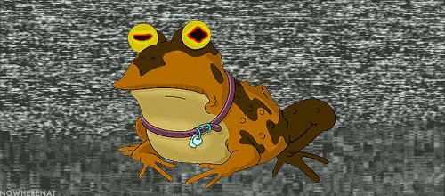

  
   

  <h3><b>Capstone Microverse JavaScript Project with Movies API</b></h3>

<!-- TABLE OF CONTENTS -->

# 📗 Table of Contents

- [📖 About the Project](#about-project)
  - [🛠 Built With](#built-with)
    - [Tech Stack](#tech-stack)
    - [Key Features](#key-features)
  - [🚀 Live Demo](#live-demo)
- [💻 Getting Started](#getting-started)
- [👥 Authors](#authors)
- [🔭 Future Features](#future-features)
- [🤝 Contributing](#contributing)
- [⭐️ Show your support](#support)
- [🙏 Acknowledgements](#acknowledgements)
- [📝 License](#license)

<!-- PROJECT DESCRIPTION -->

# 📖 [Capstone JS Project] 

Capstone Microverse JavaScript Project with Movies API webapp displays movie's name, poster, like & comments. It also allows user can submit their comments and likes. All data is preserved thanks to the external movies API service. To develop the website using HTML, CSS, JavaScript , webpack

## 🛠 Built With 

This project is built with : 1. HTML 2. CSS 3. JavaScript 4. Node package module 5. webpack

### Tech Stack 

For this projec design I am using form to create localstorage data and class object array to update the page.

<!--

  
Client

  <ul>
    <li><a href="#">HTML CSS</a></li>
  </ul>

-->
<!--

  
Server

  <ul>
    <li><a href="https://expressjs.com/">Express.js</a></li>
  </ul>

-->
<!--

Database

  <ul>
    <li><a href="https://www.postgresql.org/">PostgreSQL</a></li>
  </ul>

-->
<!-- Features -->

### Key Features 

- **[API Movies ]**
  > Create Read Update API item.
  <!--
  - **[key_feature_2]**
  - **[key_feature_3]** -->

(<a href="#readme-top">back to top</a>)

<!-- LIVE DEMO -->

## 🚀 Live Demo 

> You can live demo form here.

- No live setup yet.

(<a href="#readme-top">back to top</a>)

<!-- GETTING STARTED -->

## 💻 Getting Started 

> For using this porject simple colne this repo and run it in your local computer.
> https://github.com/byiringiroscar/movies-final-capstone-microverse-javascript.git

In order to run this project you need: 1. A computer 2. A internet Browser. 3. Clone git :
4.open index.html with your browser or text eidtor

(<a href="#readme-top">back to top</a>)

<!-- AUTHORS -->

## 👤 Author 

- Imran Hossain
- GitHub: [@imranhossainemi](https://github.com/imranhossainemi)

## 👤 Author 

- Oscar Byiringiro
- GitHub: [@byiringiroscar](https://github.com/byiringiroscar)

(<a href="#readme-top">back to top</a>)

<!-- FUTURE FEATURES -->

## 🔭 Future Features 

> In future going add more style to UX

(<a href="#readme-top">back to top</a>)

<!-- CONTRIBUTING -->

## 🤝 Contributing 

Contributions, issues, and feature requests are welcome!

Feel free to check the [issues page](../../issues/).

(<a href="#readme-top">back to top</a>)

<!-- SUPPORT -->

## ⭐️ Show your support 

> Follow and Support our work

(<a href="#readme-top">back to top</a>)

<!-- ACKNOWLEDGEMENTS -->

## 🙏 Acknowledgments 

I would like to thank Microverse and all my coding partners.
</a>

<!-- LICENSE -->

## 📝 License 

</a> This work is licensed under a <a rel="license" href="./LICENSE">mit License</a>.

(<a href="#readme-top">back to top</a>)

